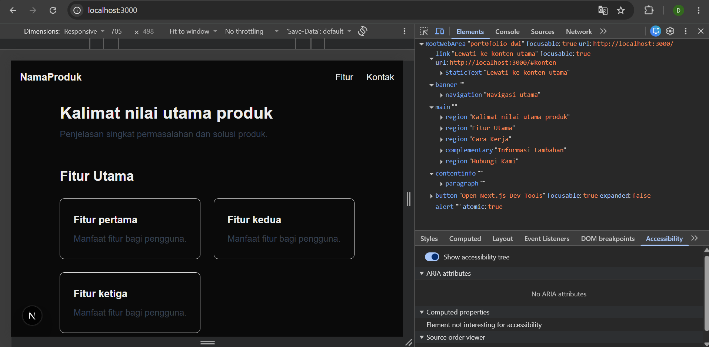
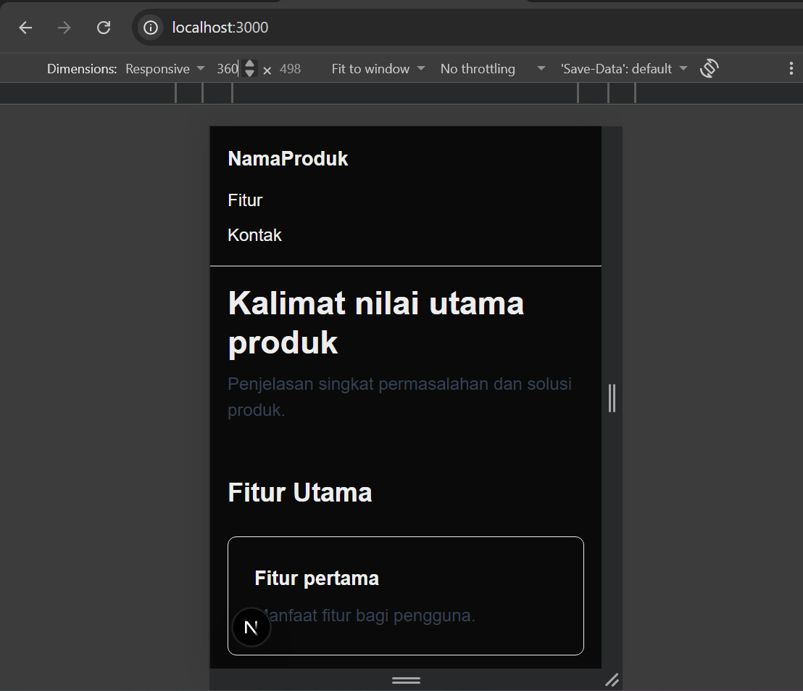
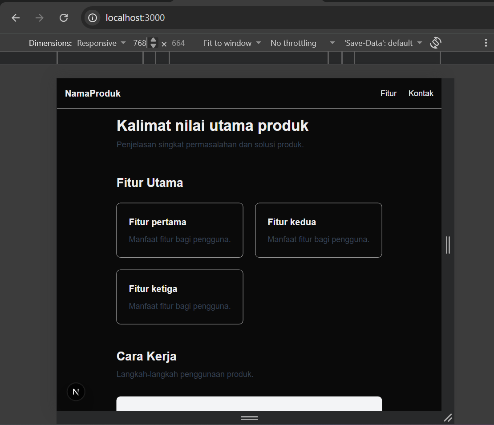
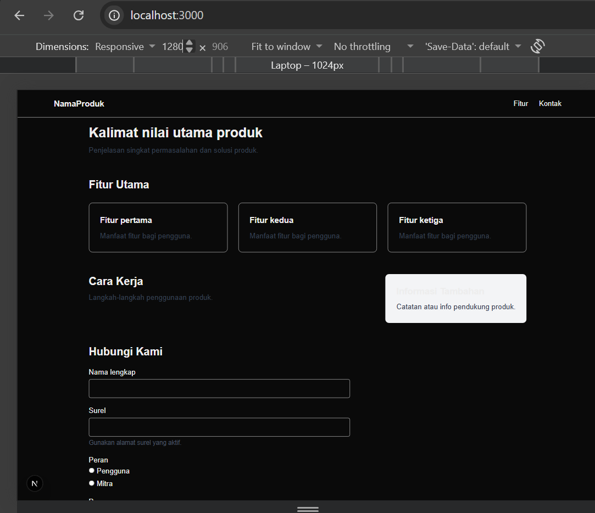

# Dokumen Teknis Modul 2 HTML Semantik, Tailwind CSS, dan Aksesibilitas

**Nama/NIM:** DWI SETIAWAN / 105224015 
**Repositori:** [Isi Link Repositori GitHub Anda]  

---

## 1. Struktur Semantik

Kerangka landmark dan hierarki judul pada halaman utama produk menggunakan elemen semantik HTML5 seperti `<header>`, `<nav>`, `<main>`, `<section>`, dan `<footer>`.

### Pohon Aksesibilitas (DevTools)

---

## 2. Tata Letak Responsif

Halaman dirancang menggunakan pendekatan *mobile-first* dengan Tailwind CSS untuk memastikan tampilan berfungsi optimal di berbagai ukuran layar.

### Tangkapan Layar Tampilan
* **Tampilan Ponsel (360 px):**  
  
* **Tampilan Tablet (768 px):**  
  
* **Tampilan Desktop (1280 px):**  
  

### Kelas Layout & Breakpoint yang Digunakan
* **Flexbox (`flex flex-col sm:flex-row`):** Digunakan pada navigasi utama agar susunan bertumpuk secara vertikal pada ponsel dan berubah menjadi horizontal mulai layar `sm` (640 px).
* **Grid (`grid grid-cols-1 sm:grid-cols-2 lg:grid-cols-3`):** Digunakan pada daftar kartu fitur agar otomatis beradaptasi dari 1 kolom (ponsel), 2 kolom (tablet), hingga 3 kolom (desktop).
* **Grid Asimetris (`lg:grid-cols-[2fr_1fr]`):** Digunakan pada bagian utama dan *aside* agar tampil berdampingan khusus pada layar besar (`lg`).

---

## 3. Audit Aksesibilitas

### Ringkasan Skor Lighthouse

| Halaman | Skor Sebelum Perbaikan | Skor Sesudah Perbaikan |
| :--- | :---: | :---: |
| Halaman Latihan (`/latihan-audit`) | 79 | 100 |
| Halaman Utama Produk (`/`) | [Skor Awal] | [Skor Akhir] |

### Daftar Temuan Audit & Perbaikan

1. **Buttons do not have an accessible name**
   * **Penyebab:** Tombol pencarian hanya berisi ikon SVG tanpa teks.
   * **Perbaikan:** Menambahkan atribut `aria-label="Cari"` pada tombol dan `aria-hidden="true"` pada ikon SVG.
2. **Image elements do not have [alt] attributes**
   * **Penyebab:** Tag `` tidak memiliki atribut teks alternatif.
   * **Perbaikan:** Menambahkan atribut `alt="Logo Next.js"`.
3. **Form elements do not have associated labels**
   * **Penyebab:** Input pencarian tidak terhubung dengan elemen label.
   * **Perbaikan:** Menambahkan `<label htmlFor="search-input">` yang terhubung ke `id` milik input.
4. **Background and foreground colors do not have a sufficient contrast ratio**
   * **Penyebab:** Teks menggunakan kelas `text-gray-300` yang terlalu terang di atas latar belakang terang/gelap.
   * **Perbaikan:** Mengubah kelas warna menjadi `text-gray-700` untuk meningkatkan rasio kontras.

### Hasil Pemeriksaan Manual dengan Papan Ketik
* **Urutan Fokus:** Navigasi fokus berpindah secara urut dari atas ke bawah (mulai dari tombol skip link, navigasi, input formulir, hingga tombol kirim).
* **Garis Fokus:** Seluruh elemen interaktif menampilkan indikator fokus yang jelas menggunakan kelas `focus-visible:outline-2`.

---

## 4. Kendala dan Penyelesaian

* **Kendala:** Tombol dengan ikon SVG tidak terbaca oleh alat pembaca layar (*screen reader*).
* **Penyelesaian:** Menambahkan `aria-label` pada tombol dan menyembunyikan elemen SVG dari pohon aksesibilitas menggunakan `aria-hidden="true"`.

---

## 5. Catatan Pemanfaatan AI

* **Alat AI:** ChatGPT / Gemini
* **Perintah Utama:** "Buatkan perbaikan kode React/Next.js agar lulus audit aksesibilitas Lighthouse dengan skor 100."
* **Bagian yang Digunakan:** Perbaikan komponen formulir, tombol ikon, dan atribut gambar pada berkas `app/latihan-audit/page.tsx`.
* **Cara Verifikasi:** Menjalankan ulang audit Lighthouse pada Google Chrome DevTools hingga meraih skor 100 dan menguji navigasi tombolmenggunakan tombol `Tab` pada keyboard.